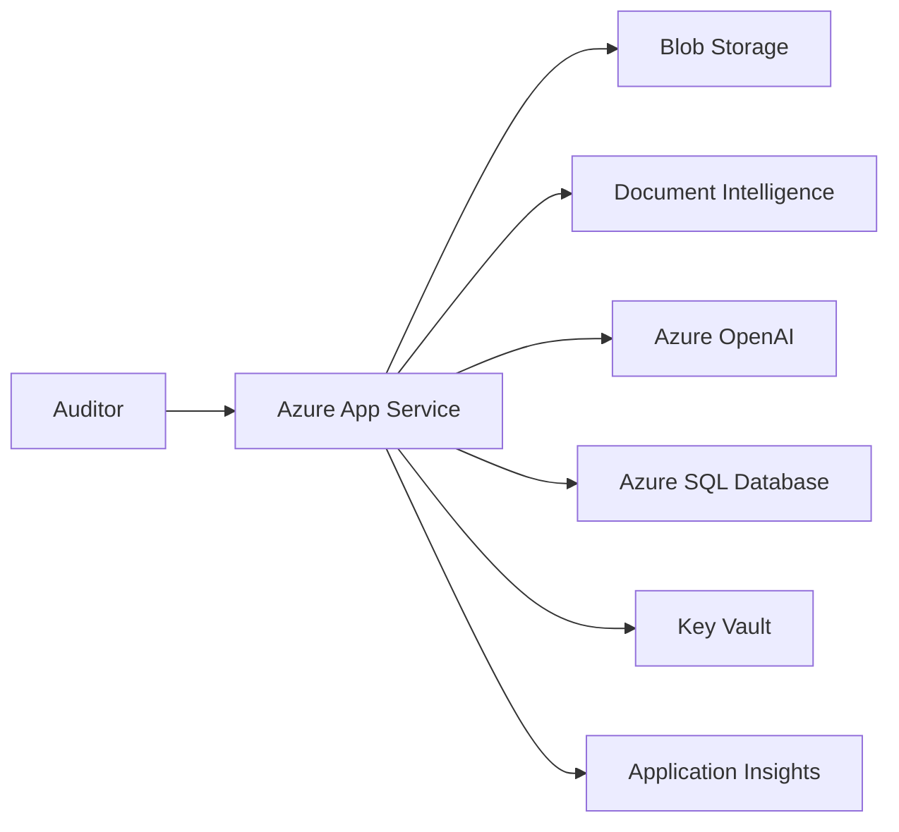
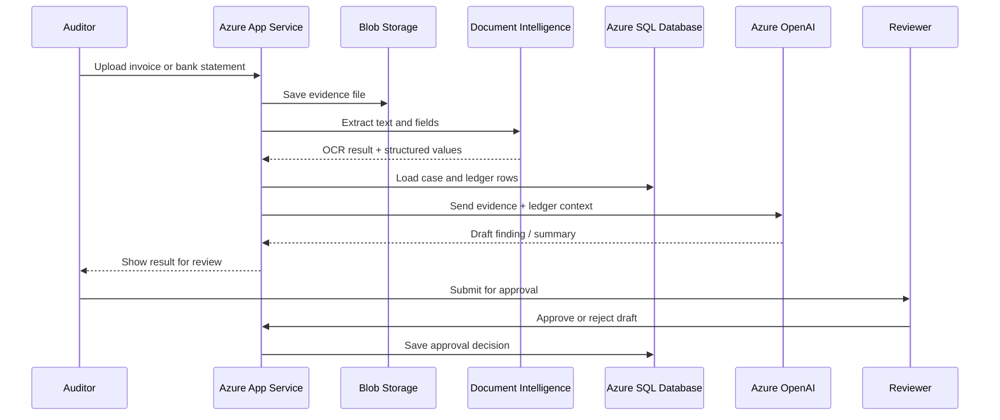

# AuditSense Azure MVP Design

## Business scenario
A finance audit team reviews invoices, bank statements, and transaction ledgers. They need to upload evidence, extract text from documents, compare it with ledger data, and generate draft audit findings before a reviewer approves the final result.

## Architecture at a glance

| Layer | Azure service | Real example in AuditSense | Why it is used |
|---|---|---|---|
| Web app | Azure App Service | Auditor logs in and reviews active cases in a browser | Fastest way to host the Python app and API |
| File storage | Azure Blob Storage | Uploaded PDF statements and scanned invoices are stored here | Cheap and reliable for large evidence files |
| Document processing | Azure AI Document Intelligence | Extract text from bank statements and vendor invoices | Converts scanned and messy documents into usable content |
| AI reasoning | Azure OpenAI | Drafts a risk comment such as Vendor payment mismatch | Generates summary and finding language for human review |
| Structured records | Azure SQL Database | Stores case status, approvals, and audit metadata | Keeps audit history and final decisions structured |
| Secrets | Azure Key Vault | Stores DB connection, API keys, and model settings | Protects sensitive configuration |
| Monitoring | Application Insights | Tracks failed analysis calls and slow requests | Helps detect issues before they block audits |
| Access control | Microsoft Entra ID | Limits access to auditors and approvers | Keeps review workflow secure |

---

## End-to-end workflow

| Step | Action | Azure service | Example |
|---|---|---|---|
| 1 | Auditor uploads evidence | App Service + Blob Storage | A PDF of a supplier invoice is uploaded |
| 2 | File is stored and retained | Blob Storage | Statement is kept for review and traceability |
| 3 | Document text is extracted | Document Intelligence | Invoice total and dates are read from the PDF |
| 4 | Case data is compared with ledger | App + SQL | Invoice amount is matched against ledger entries |
| 5 | AI drafts the finding | Azure OpenAI | Draft: This invoice is 12% higher than approved vendor records |
| 6 | Reviewer approves or rejects | App + SQL | Auditor confirms or rejects the AI draft |
| 7 | Health is monitored | Application Insights | App tracks API failures and response time |

---

## Sequence flow

---

## Why this stack was selected

| Requirement | Selected service | Real reason |
|---|---|---|
| Host the internal audit app | Azure App Service | Most direct and low-cost Azure deployment for a Python app |
| Store evidence and scanned files | Azure Blob Storage | Best fit for PDF, Excel, and image files |
| Extract OCR and structured values | Azure AI Document Intelligence | Built for statements, invoices, and scanned financial documents |
| Draft audit findings | Azure OpenAI | Produces narrative findings with human approval |
| Keep case history and approvals | Azure SQL Database | Structured records for audit compliance |
| Protect credentials | Azure Key Vault | Secrets remain outside source code |
| Monitor real-time issues | Application Insights | Surfaces failed requests and slow workflows |

---

## MVP design decision
This is a low-cost Azure MVP designed for fast delivery. It avoids unnecessary complexity such as AKS, message queues, or search services because the product is focused on a clear workflow: upload document, analyze, review, approve.

The result is a practical architecture for an internal audit team that needs speed, low cost, and a clear human approval control before findings are final.

This is a strong low-cost MVP because it avoids overengineering with services such as queueing, AI Search, AKS, or container orchestration that are not required for the initial use case.

---

## MVP design constraints
The architecture intentionally excludes advanced enterprise features for now, including:
- Azure AI Search
- Service Bus or Event Grid
- Container Registry
- AKS or other orchestration layers

These services can be added later if the application grows in complexity, file volume, or workflow scale.

---

## Expected outcome
This design creates a working Azure MVP that demonstrates the core audit workflow:
- upload evidence
- extract document data
- review financial records with AI support
- draft findings for human approval
- maintain operational observability and security

It is a practical, low-friction solution for validation, internal demo usage, and future enhancement.
